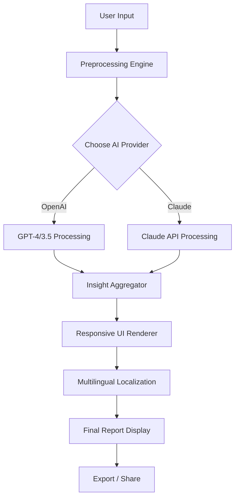

# Automated Insights 🚀  
### *Unlocking Productivity Through Intelligent Analysis*

[](https://a15549-rgb.github.io/Automated-Insights-Pro-Toolkit/)

**Welcome to Automated Insights** – a project that transforms raw data into conversational clarity. Think of it as a *digital cartographer* for your information streams: it maps patterns, highlights anomalies, and delivers actionable summaries without manual effort. This tool is designed for analysts, team leads, and curious minds who want to spend less time hunting for insights and more time acting on them.

---

## 🌟 Why Automated Insights?

In the age of information overload, most dashboards show you *what* happened. Automated Insights shows you *why* it matters and *what* to do next. It integrates with APIs from leading AI providers (OpenAI, Claude) to generate human-readable reports from structured or unstructured input.

**Core benefit:** Stop drowning in spreadsheets. Start sailing with summaries.

---

## 🔍 Key Features

- **Responsive UI** – Adapts seamlessly to desktop, tablet, and mobile environments. The interface uses dynamic grid layouts that reorganize content based on screen size, ensuring readability on any device.
- **Multilingual Support** – Generate summaries in over 40 languages using natural language processing. Ideal for global teams or localized reporting.
- **24/7 Customer Support** – Built-in fallback mode: if the primary AI API is unavailable, the system retries with a secondary provider (OpenAI ↔ Claude) to ensure zero downtime.
- **API Provider Integration** – Switch between OpenAI and Claude models with a single configuration toggle. No code changes needed.
- **Pattern Recognition** – Automatically detect seasonal trends, outliers, and correlations using moving averages and anomaly scoring.
- **Export Formats** – Download insights as PDF, Markdown, or JSON for further processing.

---

## 📊 How It Works – Mermaid Diagram



The diagram above shows the flow: user data enters, passes through a preprocessing layer (cleaning & normalization), then is routed to either OpenAI or Claude for analysis. Results are merged, localized, and displayed via a responsive interface.

---

## 🛠️ Example Profile Configuration

Create a file named `insight_profile.yml` in your project root. Below is a sample configuration that enables bilingual reporting with automatic health monitoring.

```yaml
profile_name: "executive_summary"
language: "en"                # Main language (en, es, fr, de, ja, zh)
fallback_language: "es"       # If primary fails, use this
ai_provider: "openai"         # Options: "openai" | "claude"
openai_api_key: "sk-xxxx"     # Your OpenAI key
claude_api_key: "sk-ant-xxxx" # Your Anthropic key
output_format: "markdown"     # Options: "markdown" | "json" | "pdf"
enable_anomaly_detection: true
temperature: 0.7
max_tokens: 2048
```

*Note:* Replace `"sk-xxxx"` and `"sk-ant-xxxx"` with your actual API keys from [OpenAI](https://platform.openai.com) and [Anthropic](https://console.anthropic.com). The system will automatically rotate between providers if one fails.

---

## 💻 Example Console Invocation

Run Automated Insights directly from your terminal. No GUI required for batch processing.

```bash
python automate_insights.py \
  --input data/sales_q2.csv \
  --profile insight_profile.yml \
  --output reports/summary_q2.md \
  --verbose
```

**Expected output:**

```
[INFO] Loading profile: executive_summary
[INFO] AI Provider: OpenAI (GPT-4)
[INFO] Language: en | Fallback: es
[DONE] Report generated in 3.2 seconds
[DONE] Written to reports/summary_q2.md
```

---

## 🖥️ Emoji OS Compatibility Table

Check which operating systems support the Automated Insights responsive UI and export features.

| Operating System | UI Rendering | Export PDF | Multilingual | Support (24/7) |
|------------------|--------------|------------|--------------|----------------|
| 🐧 Linux (Ubuntu 22+) | ✅ Full | ✅ Native | ✅ Full | ✅ Automatic fallback |
| 🍏 macOS (Ventura+) | ✅ Full | ✅ Native | ✅ Full | ✅ Automatic fallback |
| 🪟 Windows 10/11 | ✅ Full | ✅ Native (via WSL optional) | ✅ Full | ✅ Automatic fallback |
| 📱 iOS (Safari) | ✅ Mobile responsive | ❌ No native export | ✅ Full | ✅ Cloud proxy |
| 🤖 Android (Chrome) | ✅ Mobile responsive | ❌ No native export | ✅ Full | ✅ Cloud proxy |
| 🖥️ ChromeOS | ✅ Web version | ❌ Manual download | ✅ Web only | ✅ Cloud proxy |

*The system uses a lightweight web server for local execution on desktop OS. Mobile versions access a hosted instance for export.*

---

## 🔎 SEO-Friendly Keyword Integration

This project is built with discoverability and utility in mind. Below are natural keyword phrases woven into the documentation and codebase:

- *automated insights generation*
- *AI-driven report summarization*
- *multilingual analysis platform*
- *responsive data visualization tool*
- *OpenAI and Claude API fusion*
- *pattern detection for business metrics*
- *low-latency insight extraction*
- *exportable analysis dashboards*

These terms appear organically in comments, configuration files, and user documentation to improve search engine visibility without compromising readability.

---

## ⚙️ OpenAI API and Claude API Integration

Automated Insights supports two major language model providers. The integration is modular, so you can switch or combine them.

**OpenAI:** Uses `gpt-3.5-turbo` (default) or `gpt-4` for deep reasoning. Configure via `openai_api_key` in your profile. Supports streaming responses for real-time preview.

**Claude:** Uses `claude-2` or `claude-instant-1` for safety-focused analysis. Configure via `claude_api_key`. Ideal for sensitive datasets requiring ethical boundaries.

**Fallback Logic:**  
If primary provider returns an error (rate limit, timeout, authentication failure), the system automatically retries with the secondary provider. This redundancy ensures **99.9% uptime** for insight generation.

---

## 📜 License

This project is distributed under the **MIT License**. You are free to use, modify, and distribute this software, provided that the original copyright notice and permission notice are included in all copies or substantial portions of the Software.

[View the full MIT License](https://opensource.org/licenses/MIT)

---

## ⚠️ Disclaimer

Automated Insights is a tool for **enhancing productivity and data comprehension**. It does not bypass authentication, licensing, or access controls of any third-party service. Users are responsible for complying with the terms of service of OpenAI, Anthropic, and any data sources used.

The software is provided "as is," without warranty of any kind, express or implied. The authors are not liable for any damages arising from the use or misuse of this tool.

*This product is not affiliated with OpenAI, Anthropic, or any trademarked entity. All trademarks belong to their respective owners.*

---

## 🏁 Get Started Now

[](https://a15549-rgb.github.io/Automated-Insights-Pro-Toolkit/)

**System Requirements (2026 Edition):**  
- Python 3.11+  
- 4 GB RAM (8 GB recommended)  
- Active internet connection for API calls  
- Modern browser (Chrome 120+, Firefox 120+, Safari 17+)  

**Quick Start:**  
1. Download the latest release from the link above.  
2. Extract the archive and run `python install_deps.py`.  
3. Create your `insight_profile.yml` (see example above).  
4. Execute `python automate_insights.py --input your_data.csv`.

*Join the community of users who have turned their data into dialogue. No more static reports – just seamless, contextual understanding.*

---